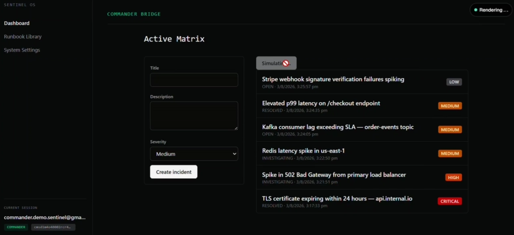
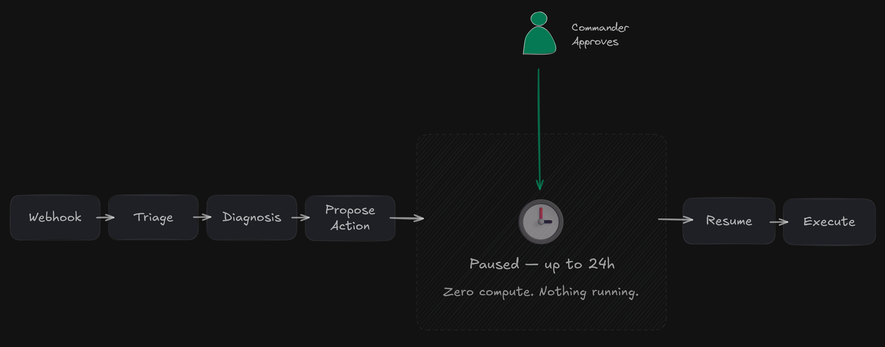
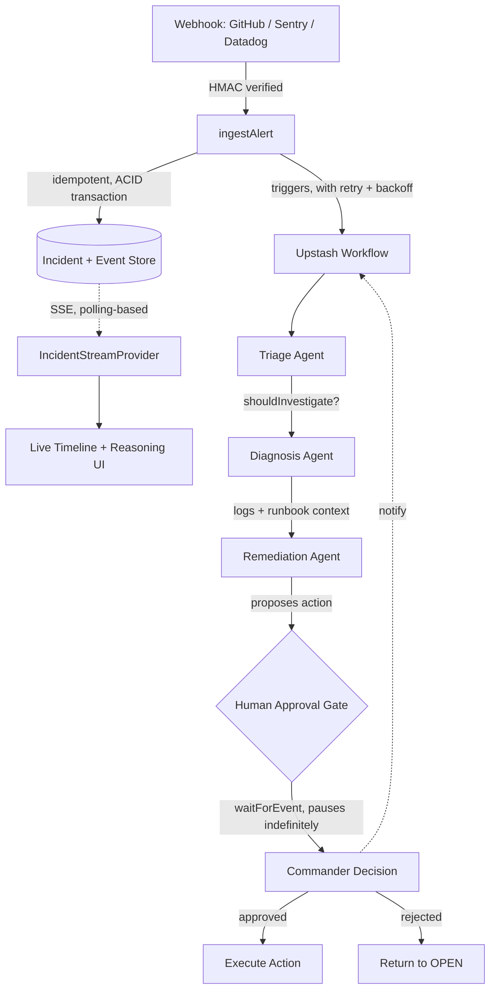
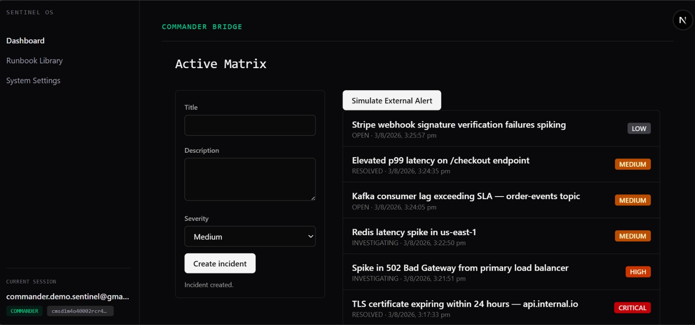
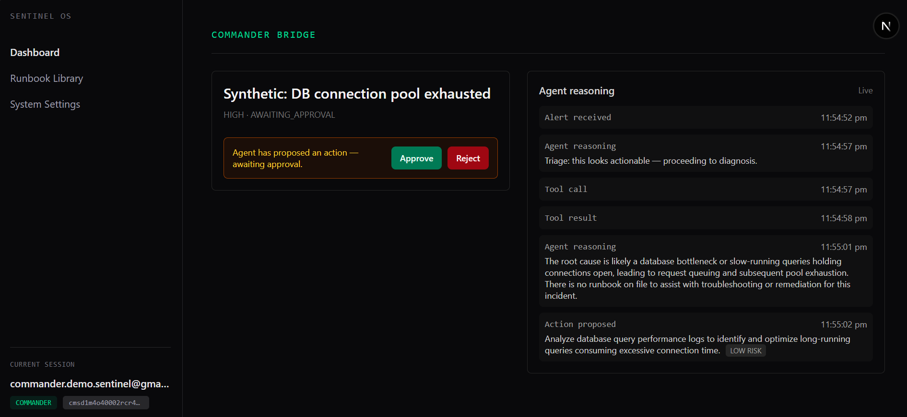
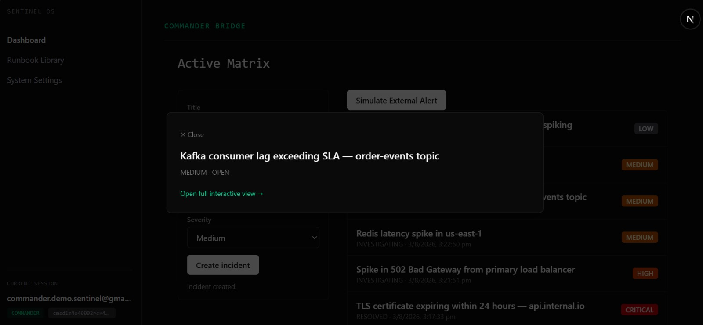

<div align="center">

# 🛡️ Sentinel OS

### Autonomous Incident Response, Gated Behind Human Approval

Sentinel receives production alerts, investigates them through a durable multi-agent
workflow, explains its reasoning in real time, and proposes a fix — but an LLM never
touches your infrastructure without a human explicitly saying yes.

[](https://nextjs.org/)
[](https://prisma.io/)
[](https://neon.tech/)
[](https://tailwindcss.com/)
[](https://upstash.com/)

</div>

---

<div align="center">



<sub>Simulate an alert → watch the agent investigate in real time → approve the proposed remediation → workflow resumes automatically.</sub>

</div>

## Why Sentinel?

Most "AI DevOps" tools are a chatbot wrapper: one API call, a summary, done. If the
process crashes mid-summary, you start over. If two webhooks arrive for the same
incident, you get two responses. Nothing about that is durable, and nothing about it
is safe to point at production.

Sentinel is built differently — as a **durable, resumable workflow**, not a single
LLM call:

- An incident's investigation survives a crashed worker, a network blip, or a
  duplicate webhook delivery. Steps are idempotent and retryable by design.
- The agent can reason, call tools, and observe results across multiple steps — a
  real `reason → act → observe → reason again` loop, not one-shot summarization.
- **No agent action ever executes without an explicit human approval event in the
  database.** Not a UI convention — an architectural constraint. An `action_approved`
  event has to exist before an action can run, full stop.

## Architecture

<div align="center">



<sub>High-level view — request boundaries, serverless vs. durable components. See the exact control-flow sequence below.</sub>

</div>



Every box on the left half of that diagram is a durable Upstash Workflow step — if
the process dies between Diagnosis and Remediation, it resumes there, not from
scratch. The Human Approval Gate is a real pause: the workflow sits idle in the
cloud, sometimes for hours, until a Commander acts.

## The Agent Pipeline

| Agent | Job | Current State |
|---|---|---|
| **Triage** | Decide whether an alert warrants investigation | Binary `INVESTIGATE` / `SKIP` based on parsed severity |
| **Diagnosis** | Identify root cause using logs + runbooks | Runbooks passed as direct prompt context; mock log tool for now — real observability + `pgvector` retrieval is Phase 5 |
| **Remediation** | Propose one concrete fix and a risk level | Structured JSON proposal (`action`, `riskLevel`), validated with Zod before it's ever shown to a human |

## Features

**Multi-tenant SaaS foundation**
Auth.js v5 (GitHub OAuth), org-scoped data access enforced at the data-access-layer
level (not just the UI), three RBAC roles — Commander, Engineer, Observer — and
encrypted-at-rest vaults for integration tokens.

**Durable agent orchestration**
Upstash Workflow + QStash. Idempotent steps, automatic retry on transient failure,
and a self-healing recovery path for the rare case where an incident is written to
the DB but the workflow trigger itself fails to fire.

**Human-in-the-loop safety, enforced server-side**
The approval gate isn't a disabled button — it's a `waitForEvent` pause in the
workflow itself, and the Server Action that resolves it re-checks role and incident
state on every call.

**Live operations UI**
Agent reasoning, tool calls, and proposed actions stream into the incident view via
Server-Sent Events as they're written — no manual refresh. A shared
`IncidentStreamProvider` powers synchronized timeline and reasoning panes through
Next.js Parallel Routes, while Intercepting Routes let Commanders and Engineers
inspect an incident in a dashboard modal without losing context. Dashboards stay
lightweight through conditional polling that only runs while an incident is
actually active.

## Screenshots

## Product Walkthrough

<div align="center">



<sub>Commander Bridge — incidents at varying severity and status, updating live via gated dashboard polling.</sub>

<br /><br />



<sub>The live reasoning feed — Triage, Diagnosis, and Remediation streaming in via SSE as the agent works, no refresh required. This is Phase 4's core feature.</sub>

<br /><br />



<sub>Incident detail opened as a modal via Next.js Intercepting Routes — dashboard context stays visible underneath.</sub>

</div>

## Tech Stack

**Implemented**

| Layer | Choice |
|---|---|
| Framework | Next.js 16 — App Router, Server Actions, Parallel & Intercepting Routes |
| Database | PostgreSQL (Neon serverless) |
| ORM | Prisma 7, Edge Driver Adapters |
| Auth | Auth.js v5, GitHub OAuth |
| Styling | Tailwind CSS v4 |
| Orchestration | Upstash Workflow, QStash |
| AI | OpenAI SDK against Google Gemini's OpenAI-compatible endpoint |
| Real-time | Server-Sent Events (polling-based, one connection per incident) |

**Incoming**

| Layer | Choice | Phase |
|---|---|---|
| Retrieval | `pgvector` for runbook + postmortem RAG | 5 |
| Rate limiting | Upstash Redis, sliding window | 6 |

## Roadmap

- [x] **Phase 0** — Foundations: Core SaaS, Edge RBAC, baseline architecture
- [x] **Phase 1** — Core CRUD
- [x] **Phase 2** — Ingestion & Event Store
- [x] **Phase 3** — Durable Agent Orchestration
- [x] **Phase 4** — Real-Time UI: SSE streaming, Parallel/Intercepting Routes, live approval reconciliation
- [ ] **Phase 5** — AI Intelligence: `pgvector` RAG over runbooks
- [ ] **Phase 6** — Hardening: Edge ingestion, Redis rate limits, blast-radius controls

## Getting Started

```bash
# 1. Clone
git clone https://github.com/Gurashish73/sentinel.git
cd sentinel

# 2. Install
npm install

# 3. Configure environment
cp .env.example .env
```

Fill in `.env`:

```bash
# App
NEXT_PUBLIC_APP_URL=          # use ngrok/cloudflared for local dev — see note below

# Database (Neon)
DATABASE_URL=
DIRECT_URL=

# Auth (GitHub OAuth App)
AUTH_SECRET=                  # npx auth secret
AUTH_GITHUB_ID=
AUTH_GITHUB_SECRET=

# Encryption (webhook secrets at rest)
ENCRYPTION_KEY=               # openssl rand -hex 32

# Durable workflow (Upstash)
QSTASH_URL=
QSTASH_TOKEN=
QSTASH_CURRENT_SIGNING_KEY=
QSTASH_NEXT_SIGNING_KEY=

# AI (Google AI Studio)
GEMINI_API_KEY=
AGENT_MODEL=                  # optional, defaults to gemini-3.1-flash-lite
```

> Verify your chosen model supports the OpenAI-compatible endpoint before changing
> `AGENT_MODEL` — newly created Gemini API keys are restricted from older model
> generations. See [Google's OpenAI compatibility docs](https://ai.google.dev/gemini-api/docs/openai).

```bash
# 4. Run migrations
npx prisma db push

# 5. Start the dev server
npm run dev
```

> **Local development note:** Upstash QStash needs a publicly reachable URL to
> deliver workflow steps and webhooks — tunnel `localhost` with ngrok or
> cloudflared and point `NEXT_PUBLIC_APP_URL` / `QSTASH_URL` at the tunnel.